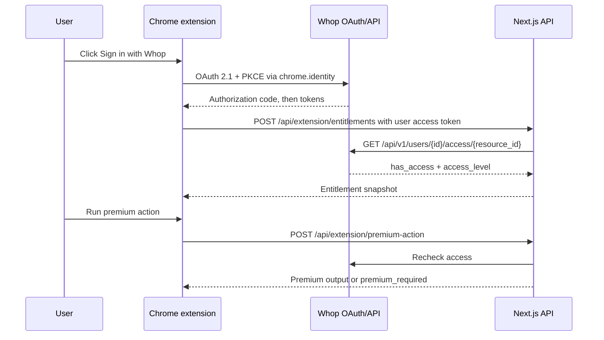

# Whop Chrome Extension Template

A starter template for building a Manifest V3 Chrome extension with Whop-backed
free and premium gating.

This repo contains two things:

1. A reusable template architecture that keeps Whop API keys on a Next.js server.
2. A working example product called Focus Lens, where the extension gives free
   local page facts and gates premium page analysis through the Whop API.

## What is included

- `apps/web`: Next.js 16 App Router app with public demo pages, Whop checkout,
  CORS-aware extension API routes, server-side entitlement checks, and a Whop
  webhook example.
- `extension`: Manifest V3 Chrome extension built with Vite and TypeScript. It
  uses `chrome.identity.launchWebAuthFlow` for Whop OAuth with PKCE.
- `docs`: research notes, architecture decisions, Whop setup, Chrome extension
  setup, security model, customization guide, and testing checklist.

## Quick start in mock mode

Mock mode lets you try the full product shape before you have Whop credentials.

```bash
pnpm install
cp apps/web/.env.example apps/web/.env.local
cp extension/.env.example extension/.env
pnpm dev:web
```

In another terminal:

```bash
pnpm build:extension
```

Then load `extension/dist` at `chrome://extensions` with Developer mode enabled.
Open the popup and use `Mock premium`.

## Codex Skill

This repo includes a bundled agent skill at `.agents/skills/whop-extension-template` for agents helping users configure Whop IDs, Vercel, checkout, OAuth redirects, and extension packaging. To install it, ask Codex:

```text
Use $skill-installer to install colinmcdermott/whop-chrome-extension-template path .agents/skills/whop-extension-template.
```

Restart Codex after installing new skills.

## Real Whop setup

Read these docs in order:

1. [Research and feasibility](docs/RESEARCH_AND_FEASIBILITY.md)
2. [Architecture](docs/ARCHITECTURE.md)
3. [Whop setup](docs/WHOP_SETUP.md)
4. [Chrome extension setup](docs/CHROME_EXTENSION_SETUP.md)
5. [Security model](docs/SECURITY.md)
6. [Customization](docs/CUSTOMIZATION.md)
7. [Testing](docs/TESTING.md)
8. [Deployment](docs/DEPLOYMENT.md)

## Core flow



## Why Next.js plus a separate extension app

Next.js is the right place for checkout pages, API routes, webhook handling, and
any premium server work. It is not the right runtime for the extension package:
Chrome Web Store review expects bundled extension code, a Manifest V3 service
worker, and no remotely hosted JavaScript. The extension is therefore a small
Vite app, while the paid product backend is Next.js.

## Sources used

- Whop OAuth: https://docs.whop.com/developer/guides/oauth
- Whop check access: https://docs.whop.com/api-reference/users/check-access
- Whop checkout embed: https://docs.whop.com/manage-your-business/payment-processing/embed-checkout
- Whop webhooks: https://docs.whop.com/developer/guides/webhooks
- Whop SaaS Starter: https://github.com/whopio/whop-saas-starter
- Chrome Manifest V3: https://developer.chrome.com/docs/extensions/develop/migrate/what-is-mv3
- Chrome identity API: https://developer.chrome.com/docs/extensions/reference/api/identity
- Chrome storage API: https://developer.chrome.com/docs/extensions/reference/api/storage
- Next.js 16 upgrade notes: https://nextjs.org/docs/app/guides/upgrading/version-16
